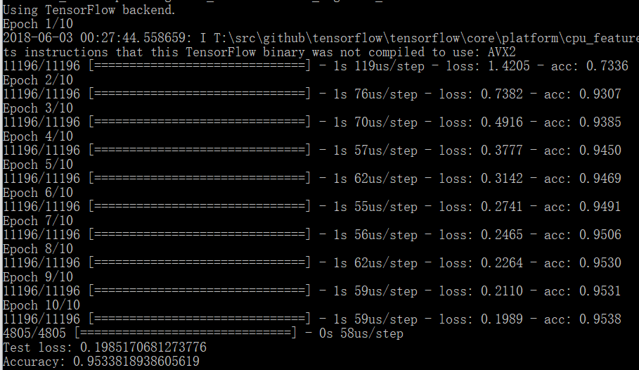

model中model.bin和model.vec为使用fasttext-skipgram训练的模型，命令:默认使用100维的embedding，/*epoch为5*/，窗口大小为5.(模型大小？)


```shell
./fasttext skipgram -input corpus_recut.txt -output model
可通过以下word2vec命令加载:
model = gensim.models.KeyedVectors.load_word2vec_format('model.vec', binary=False)
```




corpus.model是使用word2vec训练的模型，corpus_seg为未去除标点的数据，命令：

binary = True 用.model load

```python
python train_word2vec_model.py corpus_seg.txt corpus.model corpus.vector
model = gensim.models.Word2Vec.load('model/corpus.model')
```


更新了softmax.py，可以保存和加载训练的网络

